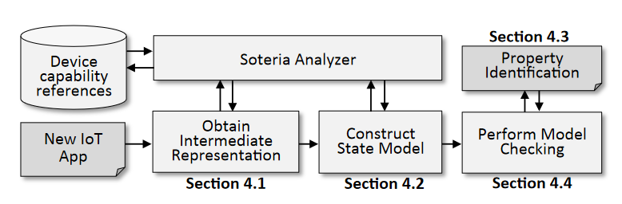
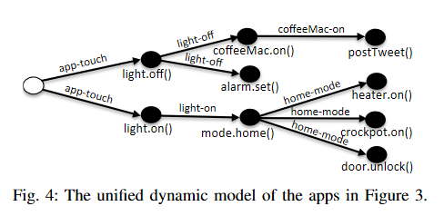
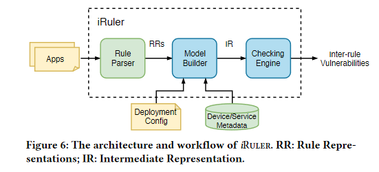

# 各工作比较

## Soteria（2018）

说法：属性违规（property violation）
**总结：** 静态分析系统，SOTERIA系统分析分为四个阶段。SOTERIA首先从一个物联网应用的源代码中提取一个中间表示（IR）。该IR被用于建模应用的生命周期，包括入口点、事件处理方法和调用图。其次，SOTERIA使用IR来提取应用的状态模型；该状态模型包括其状态和转换。最后，开发了一组物联网属性，并使用模型检测来检查该应用在独立运行时或与其他应用交互时是否符合这些属性。

- 静态系统
  - 检测：属性识别+模型检测以判断是否出现规则冲突
    - 属性来源于工作人员的广泛的调查和分析，分为通用属性和应用特定属性
  - 处理：无
  - 未考虑物理通道层面的影响
  - 区分规则交互和规则冲突

## IoTGuard（2019）

说法：冲突（conflict）、政策违规（policy violations）
**总结：** IOTGUARD 提出了一个动态、基于策略的物联网安全执行系统。它通过监控物联网应用（App）的运行时行为，构建一个统一的动态模型来表示单个应用或一组交互应用的联合行为。然后，它针对这个动态模型检查一组预先识别的安全和安全策略。如果一个应用的操作可能导致不安全或不期望的状态，IOTGUARD 会在操作执行之前动态地阻止该操作。

- 动态系统
  - 检测：检测设备的执行动作是否满足/违反策略
    - 策略来源：
      - 应用特定策略：基于对单个或多个设备使用案例的分析，继承自 IoT 领域的现有安全属性研究
      - 触发-动作平台特定策略：针对 IFTTT 等触发-动作平台固有的信任和隐私挑战，特别是集成 IoT 平台和外部在线服务（如 Twitter、Facebook）时产生的问题。
      - 通用策略：独立于任何应用语义的，关于动态模型结构本身的约束。这些是无论应用领域如何，都不应发生的结构性错误（通常是编程缺陷或竞态条件）
  - 处理：根据策略动态阻止
  - 对物理通道的支持：并不关注物理通道，仅仅关注设备执行动作层面，可以定义“窗户打开和空调打开不能同时执行”即可，无法检测到 `通过A对环境产生影响，环境的变化触发了B`这样的
  - 策略来源于专业人员，且泛化能力弱，普通用户自定义困难

## SafeChain（2019）

说法：安全威胁（权限升级、隐私泄露）
**总结：** SAFECHAIN 是一个针对物联网（IoT）触发-动作（Trigger-Action）编程（如 IFTTT 规则）中攻击链（Attack Chains）的自动化预防系统。它专注于识别复杂的权限升级和隐私泄露威胁。系统核心思想是将 IoT 生态系统建模为有限状态机（FSM），并将安全验证转化为 FSM 上的可达性问题，通过模型检测（Model Checking）方法进行穷尽式验证。为了解决模型检测中状态空间爆炸和环境建模不准确的挑战，SAFECHAIN 引入了规则感知优化（Grouping 和 Pruning）以及短期环境预测窗口，实现了高效且准确的攻击检测，并在攻击发生前提供修复建议。

- 静态系统
  - 检测：检测设备的执行动作是否违反预先定义好的安全策略
    - 策略来源：专家和社区提供的通用安全策略 以及 用户自定义和修改的策略
  - 处理：专注于汇报定义的安全威胁与最小安全规则集合，不负责处理
  - 文章说是动态，但是动态体现在：监控规则内容是否被修改从而实时更新，并不检测系统中规则事件的发生来确定是否真的发生安全威胁

流程：设置安全策略之后，利用有限状态机（穷尽式检索+剪枝优化）寻找相关路径，从而找到通往违反安全策略的路径，并汇报相关路径，给出建议（取消、移除路径中的连接规则）

## iRuler（2019）

说法：规则间漏洞（Inter-rule Vulnerabilities）
**总结**：不看设备源代码的情况下，读取每一条规则的文本描述和元数据，将规则、设备状态、环境变化抽象成形式化的模型，通过**模型检查**技术遍历所有可能运行的路径和规则组合，查看是否会达到“规则间漏洞”的危险状态

- 静态系统
  - 检测：检测设备的执行动作是否满足/违反策略
    - 策略来源：形式化定义抽象的信息流图属性（和我的论文类似）
  - 处理：无
  - 对物理通道的支持：支持，且支持区域感知，将不同区域划分为不同的环境变量，但是区域感知能力弱，依赖用户部署时的输入
  - 区分规则交互和规则冲突

## IoTIE（2019）

说法：隐藏的跨应用交互（hidden inter-app interactions through physical environments），高风险交互
**总结**： 重点关注跨平台、物理通道之间的交互。收件箱不同平台的规则翻译为统一格式，并进行环境映射（提取环境特征），然后开始进行路径匹配来提取规则之间的交互，如果交互结果会导致高风险操作，测进行标记。

- 静态系统
  - 检测：对跨平台跨物理通道交互的检测、并确定是否高风险
    - 策略来源：预定义的高风险标签（安全社区和研究人员公认的、与安全、安防或隐私高度相关的 能力（Capabilities）、设备（Devices） 和 命令（Commands））
  - 处理：无，建议安装应用后立即运行IoTIE进行检查，从而在正式使用前就避免规则冲突
  - 没有区域特征，容易产生误报（一条规则控制打开加热器，加热器在卧室，我是温度会升高，另一条规则控制如果温度很高则打开窗户，窗户在客厅，不会冲突却会产生误报）

## IoTSafe（2021）

说法：物联网系统中设备间的物理交互（Physical Interactions）和网络空间交互（Cyberspace Interaction）
**总结**：IOTSAFE 提出了一个动态安全与安全策略执行系统，专注于解决现有系统忽略的设备间真实的、具有上下文（空间和时间）特征的物理交互问题。系统通过结合静态分析和优化的动态测试技术，高效地识别出这些现实环境中的物理交互路径，并剔除静态分析带来的大量“假阳性”潜在交互。并且，IOTSAFE 建立了物理模型（Physical Models）来表征设备对环境的时间连续效应（例如加热器关闭后温度持续上升），从而能够预测即将发生的风险情况。最终实现了预防性策略执行，在风险状态发生前及时阻止或调整设备动作，避免不安全或不期望的状态出现。

- 静态+动态系统
  - 检测： 检测并发现设备间真实的物理交互链。
    - 方法： 结合静态分析（识别潜在交互）和动态测试（验证真实交互，排除假阳性）。
    - 动态测试优化： 使用顺序测试（处理相互关联的物理通道）和并行测试（处理不相关的物理通道/不同房间），以最小化测试开销（$T_{cost}$）。
    - 上下文感知： 测试考虑空间上下文（设备是否在同一房间）、时间上下文（连续效应）、隐式效应和联合效应。
  - 预测： 基于物理模型预测临近的危险状态。
    - 物理模型： 为温度、湿度、烟雾等物理通道建立数学模型，并使用动态测试收集的数据进行参数初始化和更新。
    - 时间处理： 解决传感器低报告率和设备连续效应导致的策略延迟问题，实现超前预测。
  - 处理： 预防性地执行策略，阻止可能导致风险状态的操作。
    - 策略来源： 基于用户定义的通用安全策略或设备特定策略模板，用户可修改和定制。（通用安全和安全策略+设备特定安全和安全策略）
  - 对物理通道的支持： 强力支持。系统专门为解决通过温度、湿度、运动、光照等物理通道导致的规则冲突和安全威胁而设计。能够检测到“通过 A 对环境产生影响，环境的变化触发了 B”这样的交互链。
  - 区分规则交互和规则冲突：将策略违规和不安全状态（通常是冲突的结果）作为执行目标。
  - 初始测试/部署开销大、大约需要两小时，且对环境变化敏感，测试时受人类活动干扰，安全相关设备无法测试，专业性强

## IoTCom（2022）

说法：跨网络通道（cyber channels）和物理通道（physical channels）的安全、隐私威胁
**总结**：首先对威胁进行分类，得到其中应用交互威胁，然后进行静态分析，进行行为规则提取，并转为行为规则图，然后进行形式化分析，并通过有界模型检测和穷尽式搜索探索所有可能的规则交互，从而检测出潜在的安全和安全漏洞，并使用SmartThings模拟器动态验证这些威胁

- 静态系统
  - 检测：检测设备的执行动作是否满足交互威胁
    - 策略来源：专家和社区提供的通用安全策略 以及 用户自定义和修改的策略
  - 处理：无
  - 物理通道：能感知物理通道但是无法区分不同区域，容易产生误报

## IoTMediator（2023）

说法：交互威胁
**总结**：

- 静态系统+动态
  - 检测：静态筛选、动态验证
  - 处理：定制化处理
  - 无物理通道的考量

---

这个对比的角度不够好，需要优化

对比表：

| Name        | DIC | Physical Channel | Detection Method | Auto Handling | Customized Handling | Timing of Handling  |
| :---------- | :-- | :--------------- | :--------------- | :------------ | :------------------ | :------------------ |
| Soteria     | T   | F                | static           | F             | F                   | F                   |
| IoTGuard    | T   | F*               | Dynamic          | T             | F                   | Pre-event execution |
| SafeChain   | T   | F                | Static*          | F             | F                   | F                   |
| iRULER      | T   | T*               | Static           | F             | F                   | F                   |
| IoTIE       | T   | T                | Static           | F             | F                   | F                   |
| IoTSafe     | T   | T                | both             | T             | F                   | Pre-event execution |
| IoTCom      | F   | T                | Static           | F             | F                   | F                   |
| IoTMediator | F   | F                | both             | T             | T                   | Pre-event execution |
| ours        | T   | T                | both             | T             | T                   | Pre-event execution |

> "DIC" means Distinguish between Rule Interaction and Rule Conflict.
> IoTGuard: We are not concerned with the physical channels, but only with the action execution layer of the agent. It is sufficient to define the constraint that "Window Open and Air Conditioner On cannot be executed simultaneously." We cannot detect sequences such as `A affects the environment, and the environmental change triggers B`.
> SafeChain: The article says that it is dynamic, but the dynamic part is that the monitoring of rule content is used to update in real time, and it does not detect the occurrence of rule events in the system to determine whether a security threat has occurred.
> iRULER: 支持，且支持区域感知，将不同区域划分为不同的环境变量，但是区域感知能力弱，依赖用户部署时的输入

---

可参考示例

> * **规则 R1 (方便回家)：** **IF** 智能汽车GPS显示为 $HOME$，**THEN** 解锁智能锁 (UNLOCKED)。
> * **规则 R2 (保护隐私)：** **IF** 智能锁状态为 $UNLOCKED$，**THEN** 关闭监控摄像头 (OFF)。
>   盗贼无法直接解锁智能锁或关闭摄像头（它们是高级安全的）。盗贼利用漏洞，远程入侵了**最薄弱的环节——智能汽车GPS**，并强行伪造信号，报告状态为 $HOME$。
>   防御：移除/修改R2

---

bad example:

> 1. 恶意App: 隐藏了恶意行为的第三方App: 当存在传感器检测到用户“不在家” (not present) 时, 就将整个系统的模式 (Mode) 偷偷设置为“在家” (Home)。
> 2. 在家模式App: 自动化App: 如果系统模式是“在家” (Home)，则打开加热器 (Heater On)。
> 3. 窗户控制App: 节能App: 如果温度传感器检测到温度过高 (Temp High) ，则打开窗户 (Window Open)。

---

| Name                  | DIC | Physical Channel | Zone Awareness | Detection Method | Auto Handling | Customized Handling | Timing of Handling | User Preference | User Effort | Manual Control | Generalization |
| :-------------------- | :-: | :--------------- | :------------- | :--------------- | :-----------: | :-----------------: | :----------------: | :-------------: | :---------- | :------------: | :------------- |
| **Soteria**     |  T  | F                | F              | Static           |       F       |          F          |         F         |        F        | High        |       F       | Low            |
| **IoTGuard**    |  T  | F                | F              | Dynamic          |       T       |          F          |     Pre-event     |        F        | Med         |       F       | Low            |
| **SafeChain**   |  T  | F                | F              | Static           |       F       |          F          |         F         |        F        | Med         |       F       | Med            |
| **iRuler**      |  T  | T                | T              | Static           |       F       |          F          |         F         |        F        | Low         |       F       | Low            |
| **IoTIE**       |  T  | T                | F              | Static           |       F       |          F          |         F         |        F        | Low         |       F       | Med            |
| **IoTSafe**     |  T  | T                | T              | Hybrid           |       T       |          F          |     Pre-event     |        F        | Very High   |       F       | High           |
| **IoTCom**      |  F  | T                | F              | Static           |       F       |          F          |         F         |        F        | High        |       F       | Med            |
| **IoTMediator** |  F  | F                | F              | Hybrid           |       T       |          T          |     Pre-event     |        T        | High        |       T       | High           |
| **Ours**        |  T  | T                | T              | Hybrid           |       T       |          T          |     Pre-event     |        T        | Low         |       F       | High           |
